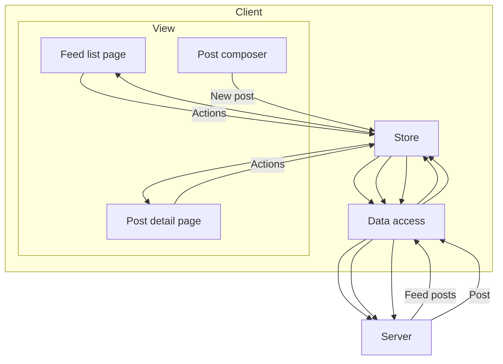
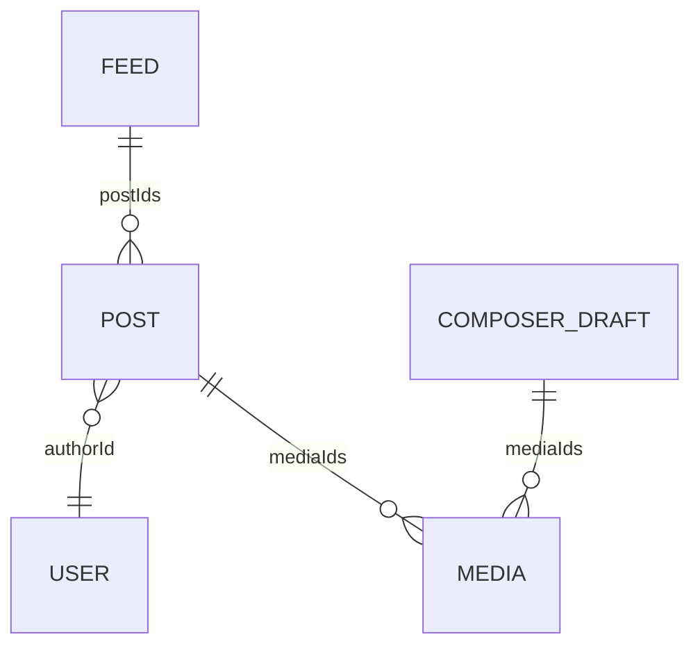
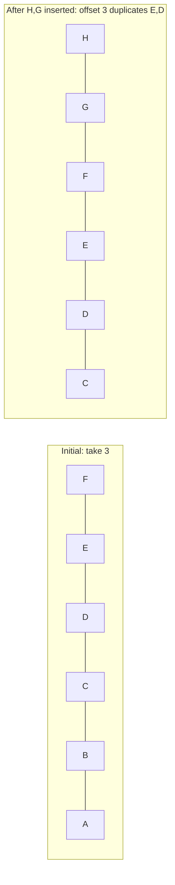
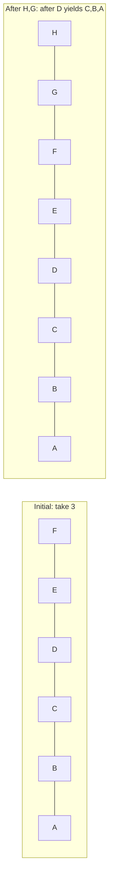
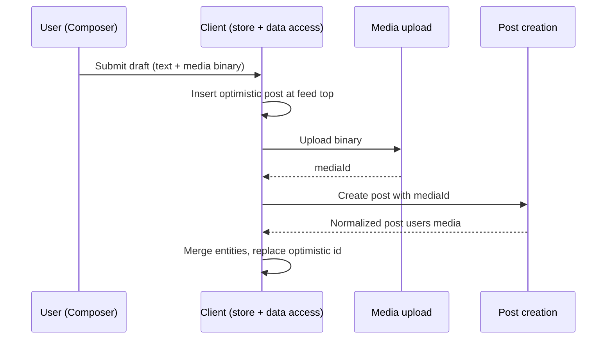

# News Feed (e.g. Facebook)


**Author:** Yangshun Tay (Ex-Meta Staff Engineer) · **Difficulty:** Medium · **~30 min** interview scope

**Companies:** Airbnb, Meta, X (Twitter), Google, Amazon, TikTok, LinkedIn, OpenAI, Discord

Designing a news feed is a classic front-end system design question because it forces tradeoffs around rendering, pagination, caching, and interaction performance.

> **2026 update**
> Refreshed with clearer architecture defaults, a normalized client store, and deeper coverage of Core Web Vitals, offline and retries, rendering-time XSS, telemetry, accessibility, and RTL. Key recommendations are surfaced as inline callouts so the core interview answer is easier to scan first.

## Question


Design a web news feed application that lets users browse a feed of posts, react to posts, and create new posts.


Assume the feed primarily contains text and image posts. Focus on the front-end architecture and the client/server contract for loading, rendering, and updating the feed.

## Real-life examples
- https://www.facebook.com
- https://www.twitter.com
- https://www.quora.com
- https://www.reddit.com
## Requirements
- Render the initial feed quickly and load more posts as the user scrolls.
- Support common feed interactions such as reactions and post creation.
- Handle long-lived sessions, stale data, and common feed performance concerns.
- You do not need to go deep on feed ranking, ads delivery, or the full back-end fan-out/pull architecture.
> **Cover the core architecture first**
> This question can go deep, but in interviews you should focus first on requirements, rendering and navigation defaults, state shape, and API shape. Only dive into pagination edge cases, virtualization, stale-session handling, or live updates if the interviewer asks for more depth.

## Requirements exploration
Before committing to a design, it helps to agree on what the product actually has to do, what kinds of content it handles, and which surfaces are in scope. The questions below are the ones worth clarifying upfront in an interview.

#### What are the core features to be supported?
- Browse news feed containing posts by the user and their friends.
- Liking and reacting to feed posts.
- Creating and publishing new posts.
Commenting, sharing, and opening a single post surface to read replies or comments can be discussed further down but are not included in the core scope.

#### What kind of posts are supported?
Primarily text and image-based posts. If time permits, we can discuss more types of posts, but keeping the scope to text and image posts is enough to cover rendering, media loading, rich text, pagination, and common mutations.

#### What pagination UX should be used for the feed?
Infinite scrolling, meaning more posts will be added when the user reaches the end of their feed. For long-lived sessions, it is also worth discussing how newer posts are surfaced at the top without silently disrupting what the user is reading.

#### Will the application be used on mobile devices?
Not a priority, but a good mobile experience would be nice. The architecture discussion can stay web-first unless the interviewer explicitly wants to focus on mobile-specific interaction patterns.

## Architecture / high-level design
A well-structured front-end architecture separates concerns across distinct layers, each responsible for a specific set of tasks. Before discussing those layers, there are two decisions to make: where to render the page and how navigation should work after the initial load.

### Rendering approach
A large-scale feed product can be built using several rendering approaches, each with different tradeoffs in performance, complexity, and infrastructure cost. The main models are server-side rendering (SSR), client-side rendering (CSR), and hybrid rendering.

- **SSR:** The server generates the full HTML before sending it to the browser. This leads to faster first paint and stronger SEO because users and crawlers receive meaningful content immediately. Once the HTML is loaded, the client hydrates the page to attach event listeners and enable interactivity.
- **CSR:** The server first delivers a minimal HTML shell and JavaScript bundles. The browser then fetches data and renders the UI on the client. CSR offers great interactivity once loaded because further updates can happen without full page reloads, but the first load is typically slower than SSR and SEO is weaker.
- **Hybrid:** Hybrid rendering combines SSR and CSR. The initial page is rendered on the server for speed, while dynamic updates happen on the client after hydration.
For a personalized signed-in feed, the main benefit of rendering on the server is performance, not SEO. The content is already personalized, so search indexing is much less important than keeping the session interactive and responsive.

That makes CSR the best default answer for the home feed. The feed is highly interactive, heavily personalized, and benefits from keeping state alive in the browser over a long-lived session. This is a long-session state-management tradeoff, not a claim that CSR has the fastest cold start. To keep LCP competitive, the CSR shell still needs tight budgets for app-shell bytes, initial feed data, and critical JavaScript. SSR or hybrid rendering can still be good choices for public post pages, marketing surfaces, or logged-out experiences, but the signed-in home feed should default to CSR.

> **Default to CSR for the signed-in home feed**
> If you need to pick a rendering strategy quickly in an interview, that's the safe answer. Mention SSR or hybrid rendering for public post pages, logged-out surfaces, or routes where SEO and cold-start content matter more.

In practice, frameworks like Next.js and TanStack Start let products mix rendering strategies by route or surface when needed, which is how a product can keep the signed-in home feed on CSR while still serving public post permalinks with SSR.

### Navigation approach
Website navigation usually follows either a single-page application (SPA) or multi-page application (MPA) model.

- **SPA:** The app loads once, then uses JavaScript to update the URL, fetch data, and update the DOM without a full page reload.
- **MPA:** Each route is a separate HTML page, and navigation triggers a full page reload.
For a feed product, SPA is the stronger default. The biggest reason is shared client state. Most users open a post from the feed itself. In an SPA, the main post details such as text, media, and author data may already be in the store, so navigation to the post detail page can feel nearly instant, and only replies or comments need to be fetched after navigation.

In an MPA, navigation tears down the current page state and rebuilds it from scratch. That makes transitions feel slower and discards useful in-memory state such as cached entities, optimistic updates, composer drafts, and scroll position.

### Architecture layers





With rendering and navigation decided, the front end can be broken down into four layers: View, Store, Data access, and Server.

- **View:** This is what users interact with directly. It includes the feed page, post detail page, feed posts, and the post composer. The View layer renders data from the store and triggers user actions such as reacting to a post or composing a new one.
- **Store:** The store is the source of truth for client-side state. It holds feed data, posts, users, composer state, optimistic updates, and freshness state. It keeps different parts of the interface consistent and lets the UI remain responsive even when the network is slow.
- **Data access:** This layer abstracts communication with the backend APIs. It handles network requests, response parsing, caching policy, pagination, retries, and transformations that convert raw API responses into structures that are easy for the store to consume.
- **Server:** The server exposes HTTP endpoints for fetching the feed, fetching a single post, creating posts, uploading media, and performing actions such as reactions and shares.
This layered architecture creates a clean separation of responsibilities. The View focuses on presentation, the Store manages state, the Data access layer handles synchronization and networking, and the Server provides canonical data.

In an SPA, the Store and Data access layers are initialized once on first load, then persist and update throughout the session as users scroll, navigate, and interact with posts.

In practice, the View layer might use React, Vue, or Svelte. The Store might use Redux, Zustand, or Jotai. The Data access layer might use RTK Query, TanStack Query, Relay, or Apollo Client.

Read more in Rendering on the web and the "Rebuilding our tech stack for the new Facebook.com" blog post.

## Data model / entities
A news feed should be modeled for efficient rendering and frequent updates, not just for mirroring raw API responses. The feed itself is not just a nested array of post objects. It is an ordered list of post IDs plus pagination and freshness metadata, while the canonical post, user, and media records live alongside it in the client store.

### Post entity
The Post entity is the canonical feed item. It contains the content needed to render the post, along with references to related entities such as the author and any attached media.

For textual content that contains mentions, hashtags, and links, it is useful to model the body explicitly instead of treating it as plain text:


```typescript
type PostBody = {
  text: string;
  entities: Array<{
    type: 'mention' | 'hashtag' | 'link';
    start: number;
    end: number;
    userId?: string;
    url?: string;
  }>;
};

type ReactionType = 'like' | 'love' | 'haha' | 'wow' | 'sad' | 'angry';

type EngagementSummary = {
  reactions: Record<ReactionType, number>;
  totalReactions: number;
  commentCount: number;
  shareCount: number;
};

type Post = {
  id: string;
  authorId: string;
  body: PostBody;
  mediaIds: string[];
  engagementSummary: EngagementSummary;
  viewerReaction: ReactionType | null;
  viewerHasShared: boolean;
  createdAt: number;
};
```
This model keeps the post itself focused on canonical post state while using references for related entities. That makes it easier to reuse the same post record across the home feed, a post detail page, or any other surface where the same post appears.

### User entity
The User entity represents authors and other participants that appear throughout the feed. It includes metadata such as display name, handle, profile photo, verification status, and relationship flags that describe how the current viewer relates to that user.


```typescript
type RelationshipToViewer = {
  isFriend?: boolean;
  isFollowing?: boolean;
  isMuted?: boolean;
  isBlocked?: boolean;
};

type User = {
  id: string;
  name: string;
  handle: string;
  profilePhotoUrl: string;
  isVerified: boolean;
  relationshipToViewer: RelationshipToViewer;
};
```
Because user data is shared across many posts and UI surfaces, it should be treated as a globally cached entity rather than duplicated inside each post. If a user's display name, avatar, or relationship state changes, every post that references that user can reflect the change immediately without duplicating and updating nested user blobs everywhere. This also avoids repeated network requests for the same user data across the feed, post detail surfaces, and related UI.

### Feed entity
The Feed entity represents the ordered feed itself. It should be thought of as a list of post IDs annotated with pagination and freshness metadata rather than as a list of fully nested post objects.


```typescript
type Feed = {
  id: string;
  postIds: string[];
  olderCursor: string | null;
  newerCursor: string | null;
  hasOlder: boolean;
  hasNewer: boolean;
  lastFetchedAt: number | null;
};
```
This structure fits how feed products actually behave. As the user scrolls down, older posts are fetched and appended. When the feed becomes stale, newer posts can be fetched separately and merged at the top later without rebuilding the entire feed from scratch. In other words, the feed is dynamic: older posts are loaded at the bottom while newer posts may be added to the top later.

### Normalized store structure

These entities should live in a normalized client store where each unique entity is stored exactly once and relationships are represented by IDs rather than nested copies. This mirrors relational database design, but applied inside the browser.


```typescript
type Media = {
  id: string;
  src: string;
  previewSrc?: string;
  alt: string;
  width: number;
  height: number;
};

type ComposerDraft = {
  body: PostBody;
  mediaIds: string[];
  uploadState: 'idle' | 'uploading' | 'failed';
  submitState: 'idle' | 'submitting' | 'submitted' | 'failed';
};

type Store = {
  feedsById: Record<string, Feed>;
  postsById: Record<string, Post>;
  usersById: Record<string, User>;
  mediaById: Record<string, Media>;
  composerDraft: ComposerDraft;
};
```
The main feed can be stored as one ordered list of post IDs while post detail views, comments, or other feed-like surfaces can reference the same canonical post, user, and media records.


### Normalized client store entity relationships





The alternative is a denormalized store where posts embed full nested user and media objects:


```typescript
type NestedPost = {
  id: string;
  author: User;
  sharedBy?: User;
  media: Media[];
};
```

That looks convenient at first, but the same user can appear as the author of one post, the resharer of another, and the author of a reply elsewhere. A single profile update then has to be found and rewritten in every embedded copy. Normalization sidesteps this: a change to usersById[id] is reflected everywhere that entity is referenced by ID, reactions and shares update one canonical Post record, and loading more posts becomes a merge of IDs and entities instead of an append of nested blobs.

> **Do not model the feed as a nested array of full post objects**
> A better default is an ordered list of post IDs plus canonical post, user, and media entities that can be reused across the home feed, post detail pages, and comments.

Data fetched from the server does not need to arrive normalized. Either the server returns a compact normalized payload, or the data access layer normalizes nested responses before writing them into the store. API simplicity favors the nested-then-client-normalize shape; serving weak client devices favors pushing normalization to the server. Large production feed products typically do the latter.

Further reading: Making Instagram.com faster: Part 3, cache first

## Interface definition (API)
The feed is driven by a small set of interfaces between the server, the data access layer, the client store, and the view. The table below summarizes which API shape sits at each boundary.

| Source | Destination | API type | Functionality |
| --- | --- | --- | --- |
| Server | Data access | HTTP | Return feed posts, single posts, and mutation responses |
| Data access | Server | HTTP | Fetch feed data and send writes such as post creation, media upload, reactions, and shares |
| Data access | Store | JavaScript | Normalize server responses and write cached entities and pagination state |
| Store | View | JavaScript | Provide rendered state such as feed posts, reactions, drafts, and freshness state |
The most interesting API to talk about will be the HTTP API to fetch a list of feed posts because the pagination approach is worth discussing. These feed APIs are personalized and should assume a signed-in user. The client should not send a userId parameter as the source of truth for identity; identity should come from session cookies or the product's authentication token mechanism.

> **Feed identity should come from the authenticated session**
> A caller-supplied userId is not a safe source of truth. Trusting the session instead avoids security mistakes and unnecessary API differences based on who the caller claims to be.

The HTTP API for fetching feed posts from the server has the basic details:

| Field | Value |
| --- | --- |
| HTTP Method | GET |
| Path | /feed |
| Description | Fetches the feed results for a user. |
In practice, this API would usually accept parameters such as count, cursor, and potentially a direction such as older or newer. That lets the same API support the initial page load, downward infinite scrolling, and background checks for newer posts in stale sessions.

### Feed pagination
These parameters are worth discussing explicitly because they define how the client pages through the feed, checks for newer posts, and sizes each response.

### Pagination approaches







Two common approaches to pagination in modern web applications are offset-based pagination and cursor-based pagination. Both fetch results in chunks, but they differ in how they identify the next slice of content and how well they handle dynamic, frequently changing datasets.

Offset-based pagination relies on numerical offsets to determine which results to fetch next. For example, a request might specify ?offset=20&limit=10 to get the next ten posts after the first twenty.

Offset-based pagination is straightforward and easy to implement, but it becomes inefficient and unreliable as the dataset grows or changes frequently. When new posts are inserted into the feed, offsets can shift, leading to duplicate or missing items.


In the above example, let's assume a page size of 3 and posts "F", "E", "D" are the first page that has been fetched. "H" and "G" are new posts added over time. If offset-based pagination is used, the new page will consist of posts "E", "D", "C", which is incorrect because the client already contains posts "E" and "D".

It also performs poorly for large offsets because databases must skip an increasing number of records to reach the desired position.

This is why offset-based pagination is a better fit for relatively static lists such as search results, where jumping to a specific page matters more than handling real-time inserts cleanly.

Cursor-based pagination uses a unique identifier such as a post ID or timestamp as a cursor that marks the boundary between pages. Instead of asking for "the next 10 results after offset 20", the client requests "the next 10 results after post ID X."

Cursor-based pagination is more stable and efficient because it does not depend on the dataset's size or ordering at query time. It works well in environments where data is frequently updated, such as a news feed where new posts appear constantly and older posts can be deleted, re-ranked, or refreshed.


In the above example, let's assume a page size of 3 and posts "F", "E", "D" are the first page that has been fetched. "H" and "G" are new posts added over time. If cursor-based pagination is used, the next fetched page will consist of posts "C", "B", "A", which is correct.

For a news feed, cursor-based pagination is the clear choice. It fits dynamic ordered feeds where new posts can be inserted, old posts can disappear, and ranking can change between requests, all while avoiding inconsistencies caused by real-time updates and scaling efficiently across large datasets.

> **For dynamic feeds, reach for cursor-based pagination by default**
> Offset pagination is mainly a better fit for relatively static, page-numbered lists such as classic search results or admin tables.

It also enables bidirectional navigation. Users can scroll down to fetch older posts while the client separately checks for newer posts at the top when the feed becomes stale, without re-fetching or skipping content.

By combining cursor-based pagination with techniques like infinite scrolling and background prefetching, the feed can remain continuous and responsive even when large volumes of content are loaded behind the scenes.

Reference: Evolving API Pagination at Slack

### Dynamic loading count
Whichever pagination style is used, the feed API typically exposes a configurable count or limit parameter alongside the cursor. We can use that flexibility to adapt how many posts to load based on the browser viewport height.

If the first feed request is initiated on the client in a CSR flow, the app can read window.innerHeight before requesting data and size the initial page more accurately. If the initial feed response is rendered on the server, the server does not know the viewport height ahead of time, so it usually overfetches slightly. Subsequent fetches can then adapt based on the measured viewport height.

### HTTP caching, deduplication, and idempotency
The data access layer is where caching, coalescing, and write semantics get enforced across the API surface. Feed and single-post responses should carry short-lived Cache-Control headers with an ETag, so a revalidation round-trip becomes a cheap 304 Not Modified when nothing has changed. A stale-while-revalidate directive lets the client paint cached data immediately while a background fetch refreshes it, which is ideal when the user bounces from a post detail page back to the feed.

In-flight request deduplication belongs in the data access layer too. If the composer fires two rapid reactions on the same post, or the user navigates away and back before a feed page resolves, the layer should coalesce identical requests and cancel superseded ones via AbortController. Mature query libraries like TanStack Query and Relay do this by default.

Writes need idempotency keys. Post creation, reactions, and shares can be retried by the client, by the service worker after reconnect, or by a proxy on a flaky network, so the server should treat a key seen twice as the same write, returning the original result instead of creating a duplicate post. Generate the key on the client (e.g. a UUID attached to the request body or an Idempotency-Key header) at the moment the user submits, not at send time, so retries carry the original key.

> **Attach an idempotency key at submit time for every mutating request**
> Generate the key when the user submits, not when the request fires, so any retry, by the client, the service worker, or a network layer, carries the same key and the server can safely deduplicate.

Besides the main feed API, a mature feed page usually needs single-post and interaction endpoints. These are still viewer-scoped through the authenticated session, so none of them should accept a caller-supplied userId.

| Endpoint | Purpose |
| --- | --- |
| GET /posts/{postId} | Fetch a single post surface or permalink page. |
| PUT /posts/{postId}/reaction | Set or change the viewer's reaction. |
| DELETE /posts/{postId}/reaction | Remove the viewer's reaction. |
This HTTP method is for users to create a new post, which will be shown in their own feed as well as the feeds of others they are friends with.

| Field | Value |
| --- | --- |
| HTTP Method | POST |
| --- | --- |
| Path | /posts |
| --- | --- |
| Description | Creates a new post. |
| --- | --- |
| Parameters | { body: '...', mediaIds: [...] } |
The parameters of the HTTP API will depend on the type of post made. In most cases, it's not a key discussion point during an interview.

If the post has media attachments, the typical flow is to initiate the upload first via a separate endpoint such as POST /media/uploads, receive a media ID or presigned upload URL in the response, and then include that media ID in the post creation payload. In many production systems, the upload endpoint usually returns a presigned URL so the client can upload directly to blob storage.

> **Upload media binaries first, then create the post by mediaId**
> For posts with attachments, upload the binary first, get a mediaId back, then include that ID when creating the post. In production, the upload step often involves getting a presigned URL so the client uploads directly to blob storage, keeping large uploads off the application server and letting post creation stay a small JSON request.

For simplicity, we'll assume attachments are directly uploaded to the app server and a mediaId is returned.

The response format can be just the single post and the client can write it straight into the normalized store:


```json
{
"post": {
```
"id": "124",
"authorId": "456",
"body": { "text": "Hello world", "entities": [] },
"mediaIds": ["m_1"],
"engagementSummary": {
"reactions": { "like": 20, "haha": 15 },
"totalReactions": 35,
"commentCount": 0,
"shareCount": 0
},
"viewerReaction": null,
"viewerHasShared": false,
"createdAt": 1620639583
},
"users": [{ "id": "456", "name": "John Doe" }],
"media": [
{
"id": "m_1",
"src": "https://www.example.com/feed-images.jpg",
"alt": "An image alt",
"width": 1200,
"height": 800
}
]
}
Given this new post data, the client store will need to merge the referenced users and media into their respective collections and prepend the new post ID to the start of the feed's postIds list. In practice, this often works best with optimistic UI: insert a temporary local post immediately, then reconcile it with the canonical server response when the request succeeds.





## Optimizations and deep dive
Feed performance depends on several parts of the page. This section covers the main areas where front-end choices affect scroll performance, write reliability, and long-running sessions:

Feed list: This section explains how the feed keeps long scrolling sessions smooth with virtualization, infinite scrolling, loading indicators, scroll restoration, stale-feed handling, and cross-tab invalidation.
Feed post optimizations: This section covers how individual posts render efficiently and safely, including data-driven renderer loading, mentions, hashtags, rich text, images, optimistic updates, timestamps, icons, and truncation.
Feed composer optimizations: This section discusses how users draft posts with rich text, safe paste handling, entity serialization, and optional composer tools that can be loaded only when needed.
Networking, resilience, offline, and retries: This section explains how the client handles errors, offline reads, outbox-backed writes, retries, and idempotency so user actions are not lost.
Comments and live updates: This section covers comment pagination, optimistic comment updates, and real-time delivery strategies for comments and reaction counts.
Performance and metrics: This section ties the earlier performance techniques to Core Web Vitals, performance budgets, JavaScript loading strategy, main-thread work, and measurement.
Accessibility: This section covers feed semantics, keyboard navigation, focus management, accessible dynamic updates, live regions, and reduced-motion handling.
Internationalization (i18n): This section discusses RTL layouts, bidirectional post text, pluralization, localized counts, and language-aware formatting.
Telemetry and observability: This section covers impression tracking, dwell time, real-user monitoring, error reporting, and feature-flagged rollout.
> **This section is intentionally deeper than the minimum interview answer**
> In most interviews, cover the core architecture first and use these optimizations only as follow-up depth when the interviewer asks you to go further.

### Feed list
The feed list refers to the container element that contains the feed post items. Once the pagination contract is decided at the API layer, the main frontend concerns here are rendering long lists efficiently and keeping scrolling smooth.

### Virtualized lists
With infinite scrolling, the feed lives in one long-lived scroll container. As the user scrolls further down, more posts are appended to the DOM, and with feed posts having complex DOM structure (lots of details to render), the DOM size rapidly increases. As social media websites are long-lived applications (especially if they are single-page apps) and the feed items list can easily grow very long quickly, the number of feed items can cause performance issues in terms of DOM size, rendering, and browser memory usage.

A virtualized list renders only the posts in the viewport plus a small overscan window. In practice, Facebook replaces the contents of off-screen feed posts with spacer <div>s whose inline height (e.g. style="height: 300px") matches the measured height of the real content, so scroll position is preserved while the heavy subtree is removed from the DOM. This improves rendering performance in terms of:

Browser painting: Fewer DOM nodes to render and fewer layout computations to be made.
Virtual DOM reconciliation: In frameworks that use a virtual DOM (e.g. React, which Facebook uses to render the feed), a simpler empty subtree makes diffing against the previous tree cheaper and produces a smaller set of real DOM mutations.
Both Facebook and Twitter websites use virtualized lists.

Virtualization works best when each item has a stable key and the client keeps track of measured heights carefully. Feed items can be tricky because text wraps differently across layouts and media loads asynchronously, so the virtualization layer may need spacer elements, measurement caches, and recomputation when image dimensions become known. The payoff is not just fewer DOM nodes; it is also less layout thrashing and more predictable scroll performance in long sessions.

Virtualization has two tradeoffs worth naming before an interviewer raises them. First, a focused element that scrolls out of the window gets unmounted, which loses focus. When a user opens a reaction menu and then scrolls, the virtualization layer needs to either keep recently focused items mounted or restore focus programmatically when they remount. Second, browser find-in-page (Ctrl/Cmd+F) only searches DOM that is present, so content outside the window is invisible to it; products sometimes add an in-app search or widen the overscan window when find-in-page is invoked via a keydown hint.

### Infinite scrolling
An infinite scrolling feed works by fetching the next set of posts when the user has scrolled to the end of their current loaded feed. This results in the user seeing a loading indicator and a short delay where the user has to wait for the new posts to be fetched and displayed.

A way to reduce or entirely eliminate the waiting time is to load the next set of feed posts before the user hits the bottom of the page so that the user never has to see any loading indicators.

A trigger distance of around one viewport height should be sufficient for most cases. The ideal distance is short enough to avoid false positives and wasted bandwidth but also wide enough to load the rest of the contents before the user scrolls to the bottom of the page. A dynamic distance can be calculated based on the network connection speed and how fast the user is scrolling through the feed.

There are two popular ways to implement infinite scroll. Both involve rendering a marker element at the bottom of the feed:

Listen for the scroll event: Add a scroll event listener (ideally throttled) to the page or a timer (via setInterval) that checks whether the position of the marker element is within a certain threshold from the bottom of the page. The position of the marker element can be obtained using Element.getBoundingClientRect.
Intersection Observer API: Use the Intersection Observer API to monitor when the marker element is entering or exiting another element or intersecting by a specified amount.
The Intersection Observer API is a native browser API and is preferred over Element.getBoundingClientRect().

> **Prefer Intersection Observer over scroll + getBoundingClientRect()**
> Use it for infinite-scroll triggers and prefetch boundaries. Scroll handlers run synchronously and getBoundingClientRect() can force layout; Intersection Observer lets the browser batch visibility checks and deliver callbacks without your code polling layout on every scroll.

The Intersection Observer API lets code register a callback that runs when a watched element enters or exits another element or the viewport. This avoids hand-rolled scroll polling and lets the browser optimize intersection tracking.

Source: Intersection Observer API | MDN

This same infrastructure can also be used to prefetch the next page slightly before the user reaches the boundary, reducing the chance that they ever see a loading state at all.

### Loading indicators
For users who scroll really fast, even though the browser kicks off the request for the next set of posts before the user reaches the bottom of the page, the request might not have returned yet and a loading indicator should be shown to reflect the request status.

Rather than showing a spinner, the better default is a skeleton placeholder that resembles the structure of a post. A lightweight shimmer loading effect can be layered on top, but the important part is reserving the expected layout so the real content can swap in with minimal visual jump.

An example of Facebook's feed loading shimmer:


Skeleton placeholders are generally preferable to a single spinner because they preserve the expected layout of the feed. Users can start scanning the structure immediately, and the real content can swap in with less visual jump.

### Preserving scroll position on remounting
Feed scroll positions should be preserved if users navigate to another page and back to the feed. This can be achieved in single-page applications if the feed list data is cached within the client store along with the scroll position. When the user goes back to the feed page, since the data is already on the client, the feed list can be read from the client store and immediately presented on the screen with the previous scroll position; no server round-trip is needed.

This is even more important when the product supports navigating from the feed into a single post page and back. If the client already has the feed entities and scroll position cached, the round-trip back to the feed can feel instantaneous.

### Stale feeds
It's not uncommon for users to leave their news feed application open as a browser tab and not refresh it at all. It'd be a good idea to prompt the user to refresh or refetch the feed if the last fetched timestamp is more than a few hours old, as there can be new posts and the loaded feed is considered stale. When a new feed is refetched, the current feed can be entirely removed from memory to free up memory space.

Another approach is to automatically append new feed posts to the top of the feed, but that might not be desired and extra care has to be taken in order not to affect the scroll position.

As of writing, Facebook forces a feed refresh and scrolls to the top if the tab has been left open for a certain duration.

A middle-ground approach, which many feed products use, is to fetch newer posts in the background and show a "New posts available" banner at the top of the feed. That preserves the user's reading position and gives them control over when those newer posts should be merged into the visible list.

> **Avoid silently prepending new posts while the user is reading**
> A banner such as "New posts available" is usually safer because it preserves reading position and lets the user choose when to merge newer content.

Time-based staleness is only half of the story. Server-driven invalidation lets the backend tell the client "your feed is out of date" over the same live-update channel discussed later, either by pushing a version/high-water-mark that the client compares against or by delivering specific entity updates directly. That way, a viral post pulling in thousands of reactions per second or a removed post doesn't wait for the next refresh check to reflect in a long-lived tab.

A user with two tabs open introduces the mirror problem: reacting in one tab leaves the other showing stale state. The simplest cross-tab story is a BroadcastChannel that the data access layer writes to whenever it mutates a canonical entity; peer tabs subscribe and re-read the affected record from the shared store. Where a local database like IndexedDB backs the store, the Web Locks API can elect a leader tab to own long-lived socket or polling state, with followers reading from shared storage.

Pair optimistic updates with a cross-tab invalidation signal
Shared storage alone does not notify other tabs of changes. Without a BroadcastChannel or equivalent, a reaction applied in one tab will sit stale in another tab until the user interacts with it.

### Feed post optimizations
The feed post refers to the individual post element that contains details of the post: author, timestamp, contents, like/commenting buttons.

### Delivering data-driven dependencies only when needed
News feed posts can come in many different formats (text, image, videos, polls, etc.), and each post requires custom rendering code. In reality, the Facebook feed supports over 50 different post formats!

One way to support all the post formats on the client is to have the client load the component JavaScript code for all possible formats upfront so that any kind of feed post format can be rendered. However, not all users' feeds will contain all the post formats, and there will likely be a lot of unused JavaScript. With the large variety of feed post formats, loading the JavaScript code for all of them upfront is sure to cause performance issues.

If only we could lazy load components depending on the data received! That's already possible but requires an extra network round-trip to lazy load the components after the data is fetched and we know the type of posts to be rendered.

Facebook fetches data from the server using Relay, which is a JavaScript-based GraphQL client. Relay couples React components with GraphQL to allow React components to declare exactly which data fields are needed, and Relay will fetch them via GraphQL and provide the components with data. Relay has a feature called data-driven dependencies via the @match and @module GraphQL directives. The GraphQL payload can include metadata describing which renderer module matches the returned data, and the client then loads that module dynamically. This avoids shipping every renderer upfront and reduces the need for a separate render-time discovery step after the data shape is known.


# Sample GraphQL query to demonstrate data-driven dependencies.
... on Post {
content @match {
...TextPostFragment @module(name: "TextComponent.react")
...ImagePostFragment @module(name: "ImageComponent.react")
}
}
The @match directive on the content field tells Relay that the selection is type-conditional, and each fragment spread is paired with @module(name: ...) to declare which component renders that type. At query time, the server selects the matching data branch and returns module metadata alongside the GraphQL payload. The client still loads the matching JavaScript module dynamically, but only for the renderer that is actually needed.

JS modules CDN
GraphQL server
Client (Relay)
JS modules CDN
GraphQL server
Client (Relay)
Query with @match / @module
Data + chosen module name
Lazy-load TextComponent.react (only the matched one)
Module
Render post with matched component


Data-driven dependencies lazy-loading only the matched renderer
This idea also applies beyond post formats. Hover cards, richer composer tools, and other interaction-heavy widgets can often be kept out of the initial bundle and loaded only when the user demonstrates intent.

The caveat is that dynamic renderer chunks can create a data-then-code waterfall. Common above-the-fold renderers should be part of Tier 2 loading or prefetched once the initial feed payload makes their need likely, so the first visible posts do not wait on a second round trip.

Source: Rebuilding our tech stack for the new Facebook.com

### Rendering mentions/hashtags
You may have noticed that textual content within feed posts can be more than plain text. For social media applications, it is common to see mentions and hashtags.

Facebook post with mention and hashtag

In Stephen Curry's post above, see that he used the "#AboutLastNight" hashtag and mentioned the "HBO Max" Facebook page. His post message has to be stored in a special format such that it contains metadata about these tags and mentions.

What format should the message be in so that it can store data about mentions/hashtags? Let's discuss the possible formats and their pros and cons.

Entity ranges (recommended): Store the plaintext once and attach metadata describing which character ranges correspond to mentions, hashtags, or links.


```json
{
```
"entities": [
{
"type": "mention",
"start": 10,
"end": 24,
"userId": "u_99"
},
{
"type": "link",
"start": 28,
"end": 57,
},
{
"type": "hashtag",
"start": 58,
"end": 65
}
]
}
Entity ranges are compact because the text is stored exactly once, and the format is easy to render on any client. Edits become trickier because inserting or deleting characters requires updating indexes, but that is a composer concern, not a storage concern. The editor can keep a richer tree model internally and serialize to entity ranges at the API boundary. This is a good default for the server/client contract.

In the example above, start is inclusive and end is exclusive
This is a half-open range matching String.prototype.slice semantics. Stating the convention explicitly matters because an off-by-one here silently breaks mention and link boundaries at render time.

Custom syntax: Before entity ranges became standard, products encoded mentions with an inline syntax like [[#1234: HBO Max]], sufficient to capture the entity ID plus the display text, which sites like Facebook let users customize. Hashtags often need no syntax at all because a regex over #word is enough at render time. Custom syntax is a lightweight solution for products that do not anticipate growing the set of rich text entities.

Rich text editor format (reference): Editor frameworks like Lexical, TipTap, and Slate define their own serialization, typically as blocks of text plus a side table of entities keyed by ID. Meta's older Draft.js is now deprecated but still a useful reference for the shape: RawDraftContentState is an array of blocks (raw text plus entity ranges pointing into character offsets) together with a separate entityMap. These formats extend naturally to more entity types but are more verbose than entity ranges on the wire, which is why compact entity ranges are usually preferable for the server/client contract even when the editor itself is tree-based.

HTML format (anti-pattern): The naive option is to store the already-rendered HTML. This is the wrong default. Rendering server-stored HTML is a direct XSS vector, it couples the API to web-specific markup so it is harder to reuse on iOS, Android, or any non-web client, and it makes it harder to re-decorate mentions or hashtags later.

> **Do not store user-generated post content as raw HTML on the server**
> Rendering server-stored HTML is a direct XSS vector, and it also couples the API to web-specific markup, making the same payload harder to reuse on iOS, Android, or any non-web client.

### Rendering rich text safely
Structured entity-range payloads close the storage-level XSS door but do not close all the render-time doors. A feed product renders user-supplied text, user-supplied link URLs, and sometimes user-supplied media captions, and each of those is a potential vector.

Output encode the plaintext. Modern frameworks (React, Vue, Svelte) escape text interpolation by default. The only way to reintroduce the XSS risk is to opt into dangerouslySetInnerHTML or equivalent — don't, unless the content has already passed through a sanitizer like DOMPurify and the allowed tag list is explicit.
Validate href URL schemes. A mention or link entity can carry a javascript:, data:, or vbscript: URL that executes script when the user clicks. Before rendering an <a href>, check the URL scheme against an allowlist of http, https, and mailto, and reject or strip everything else.
Harden outbound links. Use rel="noopener noreferrer" on every link that opens a new tab to prevent window.opener tab-nabbing, and use target="_blank" only when the UX genuinely benefits.
Set a Content Security Policy. A CSP with default-src 'self', a tight script-src, and an img-src allowlist that includes only the product's media CDN is the defence-in-depth layer that catches what passes the other controls. Restrictive CSPs are especially important for feed products because they render links, images, and embeds from arbitrary third-party sources.
Validate every user-controlled URL scheme before rendering
javascript: and data: URLs in mention or link entities render as clickable bombs. Allowlist http, https, and mailto; reject everything else at render time, not only at submission time.

### Rendering images
Since there can be images in a feed post, we can also briefly discuss some image optimization techniques:

Content Delivery Network (CDN): Use a CDN to host and serve images for faster loading performance.
Modern image formats: Use modern image formats such as AVIF and WebP for significantly better compression than JPEG or PNG. AVIF typically produces the smallest files at a given quality but has slightly narrower browser support than WebP, so pair them with a <picture> fallback chain (AVIF → WebP → JPEG/PNG).
s should use proper alt text
Facebook provides alt text for user-uploaded images by using Machine Learning and Computer Vision to process the images and generate a description.
Generative AI models are also very good at doing that these days.
Lazy loading
Use loading="lazy" as a good default for feed images.
Use IntersectionObserver when you want more control and want to start loading slightly before the media enters the viewport.
Image loading based on device screen properties
Send the browser dimensions in the feed list requests so that server can decide what image size to return.
Use srcset or <picture> if there are image processing (resizing) capabilities to load the most suitable image file for the current viewport.
Reserve space before image load
Include image dimensions in the payload so the UI can reserve aspect ratio ahead of time and reduce Cumulative Layout Shift.
width and height attributes on the  element (or the CSS aspect-ratio property) let the browser compute the layout box before the bytes arrive.
Adaptive image loading based on network speed
Devices with good internet connectivity/on WiFi: Prefetch offscreen images that are not in the viewport yet but about to enter viewport.
Poor internet connection: Render a low-resolution placeholder image and require users to explicitly click on them to load the high-resolution image.
Progressive placeholders
Use blurred previews or LQIP/BlurHash-style placeholders so users get immediate feedback that media is loading.
On the upload side, the composer should do two things before the bytes leave the device. First, strip EXIF metadata because user photos often carry GPS coordinates, camera serial numbers, and timestamps that most users do not realize they are about to publish. Re-encode the image through a <canvas> to drop the EXIF block, or pipe the bytes through a small library that rewrites it. Second, honor the EXIF orientation flag before re-encoding so portrait photos from iOS do not render sideways. Client-side resizing to the largest size the product actually displays is also worthwhile: it reduces upload bandwidth on mobile networks and removes a class of server-side rescale work.

If the feed later supports video, the same principles still apply. Poster frames, deferred playback, and adaptive bitrate streaming are natural follow-up optimizations.

Strip EXIF metadata from user-uploaded images before leaving the device
Camera EXIF blocks routinely contain GPS coordinates and device identifiers. Re-encoding the image through <canvas> in the composer both removes the metadata and lets the client apply the orientation flag so portraits do not render sideways.

### Lazy load code that is not needed for initial render
Many interactions with a feed post are not needed on initial render:

Reactions popover
Dropdown menu revealed by the top-right ellipsis icon button, which is usually meant to conceal additional actions
Hover cards or richer profile previews
The code for these components can be downloaded when:

The browser is idle as a lower-priority task
On demand, when the user hovers over the buttons or clicks on them
Slightly before use, by prefetching on pointer down or route hover
These are considered Tier 3 dependencies under the Facebook loading-tier model discussed in the performance section.

### Optimistic updates
Optimistic updates is a performance technique where the client immediately reflects the updated state after a user interaction that hits the server and optimistically assumes that the server request succeeds, which should be the case for most requests. This gives users instant feedback and improves the perceived performance. If the server request fails, we can revert the UI changes and display an error message.

For a news feed, optimistic updates can be applied for reaction interactions by immediately showing the user's reaction and an updated total count of the reactions.

Server
Client (store + view)
User
Server
Client (store + view)
User
Apply optimistic update, UI shows new reaction and count
Reconcile, optimistic state confirmed
Revert UI, show error toast
alt
[Success]
[Failure]
Click reaction
Send reaction mutation
{ viewerReaction, engagementSummary }
Error


Reaction flow with optimistic update and rollback
The same technique can also be used for shares and for post creation itself. With a normalized store, the optimistic update becomes much easier because the client can update one canonical post record and have that reflected across the home feed, a post-detail page, or any other placement where the same post appears.

Optimistic updates are a powerful feature built into modern query libraries like Relay, SWR, and React Query.

The clean success/failure picture above hides the edge cases worth naming in an interview. The server response is always authoritative: if the returned engagementSummary disagrees with the optimistically predicted counts, the server value wins, even if the UI jumps visibly. Racing mutations on the same post need a last-writer-wins or server-sequence-number rule; two rapid reaction taps should not interleave into an inconsistent state. Offline writes should land in the outbox (covered in the resilience section below) rather than silently vanish; the UI shows the optimistic state with a pending indicator until the write eventually drains. And idempotency keys on the original request keep retries safe across all of this because the server treats a replayed reaction or post creation as the same event rather than a duplicate.

### Timestamp rendering
Timestamp rendering is a topic worth discussing because of a few issues: multilingual timestamps and stale relative timestamps.

Multilingual timestamps: Globally popular sites like Facebook and Twitter have to ensure their UI works well for different languages. There are a few ways to support multilingual timestamps:

Server returns the raw timestamp: The server returns the raw timestamp and the client renders it in the user's language. This approach is flexible but requires the client to contain the grammar rules and translation strings for different languages, which can amount to significant JavaScript size depending on the number of supported languages.
Server returns the translated timestamp: This requires processing on the server, but you don't have to ship timestamp formatting rules for various languages to the client. However, since translation is done on the server, clients cannot manipulate the timestamp on their own.
Intl API: Modern browsers can leverage Intl.DateTimeFormat() and Intl.RelativeTimeFormat() to transform a raw timestamp into translated datetime strings in the desired format.

const date = new Date(Date.UTC(2021, 11, 20, 3, 23, 16, 738));
console.log(
new Intl.DateTimeFormat('zh-CN', {
dateStyle: 'full',
timeStyle: 'long',
}).format(date),
); // 2021年12月20日星期一 GMT+8 11:23:16

console.log(
new Intl.RelativeTimeFormat('zh-CN', {
numeric: 'always',
style: 'long',
}).format(-1, 'day'),
); // 1天前
Relative timestamps can turn stale: If timestamps are displayed using a relative format (e.g. 3 minutes ago, 1 hour ago, 2 weeks ago, etc.), recent timestamps can easily go stale, especially for applications where users don't refresh the page. A timer can be used to constantly update the timestamps if they are recent (less than an hour old) so that any significant time that has passed will be reflected correctly.

Refresh recent relative timestamps with a low-frequency timer
Without it, "2 minutes ago" can sit on screen for hours in a long-lived session. Older timestamps can stay static because the next bucket boundary (days, weeks, months) is far enough away that the user is unlikely to notice drift.

### Icon rendering
Icons are needed within the action buttons of a post for liking, commenting, sharing, etc. There are a few ways to render icons:

| Approach | Pros | Cons |
| --- | --- | --- |
| Separate image | Simple to implement. | Multiple download requests per image. |
| --- | --- | --- |
| Spritesheet | One HTTP request to download all icon images. | Complicated to set up. |
| --- | --- | --- |
| Icon fonts | Scalable and crisp. | Glyphs are rendered as text characters (often in the Unicode Private Use Area), which can confuse screen readers and be affected by text styling overrides. Flash of unstyled/invisible text (FOUT/FOIT) while the font loads. |
| --- | --- | --- |
| SVG | Scalable and crisp. Cacheable. | Flickering when file is being downloaded. One download request per image. |
| --- | --- | --- |
| Inlined SVG | Scalable and crisp. | Not cacheable independently; repeats inflate HTML/JS payload size. |
Facebook and Twitter use inlined SVGs, and that also seems to be the trend these days. This technique is not specific to news feeds; it's relevant to almost every web app.

Source: "Rebuilding our tech stack for the new Facebook.com" blog post

### Post truncation
Truncate posts that have very long message content and reveal the rest behind a "See more" button.

For posts with a large amount of activity (e.g. many likes, reactions, shares), abbreviate counts appropriately instead of rendering the raw count so that it's easier to read and the magnitude is still sufficiently conveyed:

Good: John, Mary and 103K others
Bad: John, Mary and 103,312 others
This summary line can be constructed either on the server or on the client. The pros and cons of doing it on the server vs the client are similar to those of timestamp rendering. However, you should definitely not send down the entire list of users if it's huge, as it's likely not needed or useful.

### Feed composer optimizations
The composer is the surface where users draft and submit new posts. Its main front-end concerns are rich-text editing for mentions and hashtags, and lazily loading the optional pickers and uploaders that most sessions never open.

### Rich text for hashtags and mentions
When drafting a post in the composer, it'd be nice to have a WYSIWYG editing experience that looks like the result and contains hashtags and mentions. However, <input>s and <textarea>s only allow input and display of plain text. The contenteditable attribute turns an element into an editable rich text editor.

Try it for yourself here:

This sentence is editable and format-able text thanks to contenteditable. You can even format the text (e.g. bold by using Ctrl/Cmd + B).

However, it is not a good idea to use contenteditable="true" as-is in production because it comes with many issues. It'd be better to use battle-tested rich text editor libraries.

contenteditable is a browser primitive, not a full editor
It isn't a production editor architecture on its own. Use it underneath an editor framework or a carefully designed editing model rather than relying on the browser's default rich-text behavior directly.

The composer is also an XSS entry point, not just a rendering one. Paste events can carry HTML from other applications, drag-and-drop from a browser tab can include script-bearing markup, and clipboard contents are under the attacker's control. Intercept paste and drop events, read text/plain from the DataTransfer, and discard the text/html variant, or pass it through a sanitizer that allows only an explicit whitelist of tags before the editor accepts it. A composer that trusts text/html from the clipboard is one browser bug away from rendering the attacker's markup.

Meta has built open source rich text editor libraries like Draft.js (deprecated) and Lexical. Other popular open source alternatives include TipTap and Slate.

One useful distinction is that the editor's internal representation does not need to match the API/storage format exactly. A composer can use a tree-based rich text model internally for editing, but still serialize to a more compact entity-range format when sending the payload to the server.

The editor's internal model need not match the wire format
A composer can use a rich tree model for selection and undo, while the API and storage format benefits from being compact and easy to render. Serialize between the two at the boundary instead of forcing one shape to do both jobs. This also allows the same model to be rendered on platform-specific surfaces like web / iOS / Android.

Source: Facebook open sources rich text editor framework Draft.js

### Lazy load dependencies
Like rendering news feed posts, users can draft posts in many different formats that require specialized rendering code per format. Lazy loading can be used to load the resources for the desired formats and optional features in an on-demand fashion.

Non-crucial features where the code can be lazy loaded on demand:

Image uploader
GIF picker
Emoji picker
Sticker picker
Background images
These features are good candidates for interaction-based loading because many users will never open them in a given session, yet they often bring sizable JavaScript and asset costs.

### Networking, resilience, offline, and retries
Users can lose connectivity, switch networks, or close the tab while a request is still pending. The data access layer should handle those cases so the UI stays usable and user actions are not lost.

### Error states
Clearly display error states if any network requests have failed, or when there's no network connectivity.

Transient failures such as a failed pagination request or a dropped reaction request should usually be handled locally with an inline error bar, toast, or retry affordance rather than collapsing the whole page into a blank state. For more severe failures, such as an initial feed load failing completely, show a fallback state with a short explanation and a retry button.

### Reading offline
A Service Worker is the foundation. On first load it caches the app shell so repeat visits boot instantly, and it can apply a cache-first strategy for the last N feed pages plus the media of the most recently visible posts. A user who opens the app on a subway train should see the last feed they scrolled through, with posts clearly flagged as cached. Third-party query libraries like TanStack Query persist their cache to IndexedDB for the same reason: the client-side store survives tab reloads and the feed can render from cache while a background fetch revalidates.

The rendering cost of showing cached content is a little extra UI complexity (a "connection lost" banner, disabled write controls where appropriate, cached-post indicators) and an explicit caching policy per resource class: cache-first for media and the app shell, stale-while-revalidate for feed pages, and network-only for write endpoints that should not be served from the cache.

### Writing offline with an outbox
For writes, reacting, sharing, or creating a post, the client should never drop a user's action because the tab lost connectivity for three seconds. The standard pattern is an outbox: when the composer submits, the data access layer writes the pending mutation to IndexedDB keyed by its idempotency key, applies the optimistic update to the store, and fires the network request. If the request succeeds, the outbox entry is dropped. If it fails, it stays in the outbox and is retried.

Server
Outbox (IndexedDB)
Client (store + view)
User
Server
Outbox (IndexedDB)
Client (store + view)
User
Keep optimistic post with pending indicator
Retain entry for retry
alt
[Online and success]
[Offline or transient failure]
Submit post
Persist pending mutation (idempotency key)
Send create-post mutation with idempotency key
{ post, users, media }
Remove from outbox
Replace optimistic id with server id


Outbox-backed post submission flow
The Background Sync API lets the Service Worker flush the outbox after the tab has been closed, though browser support is uneven (Safari notably lacks it), so treat it as a best-effort optimization and keep an in-tab retry loop as the correctness path.

### Retry strategy
Retry with exponential backoff plus jitter is the standard approach: doubling delays with a random offset prevents a thundering herd of clients all reconnecting in lockstep after a brief outage. Cap the retry count so a permanently broken request surfaces as an error instead of retrying forever, and short-circuit retries on non-retryable HTTP status codes (400, 401, 403, 404, 422) that will not succeed on a second attempt.

Combine this with the request deduplication and idempotency keys from the API section, and the write path becomes safe under any mix of client retries, Service Worker retries, and network middlebox retries. The server always sees the same key and returns the same response.

Pair optimistic writes with an outbox and idempotency keys
Without the outbox, a dropped connection loses the user's action the moment the tab closes. Without idempotency keys, a retry from either the client or the Service Worker creates duplicate posts. Together, the outbox and idempotency keys make optimistic UI reliable even when requests are retried or the tab closes.

### Comments and live updates
Comments are the feed's second rendering surface, so we cover how to fetch, draft, and optimistically update them before layering on real-time delivery for new comments and reaction counts.

### Feed comments
If time permits, we can discuss how the feed comments can be built. In general, the same rules apply to comment rendering and comment drafting:

Cursor-based pagination for fetching the list of comments.
Drafting and editing comments can be done in a similar fashion as drafting/editing posts.
Lazy load emoji/sticker pickers in the comment inputs.
### Optimistic updates
Immediately reflect new comments by appending the user's new comment to the existing list of comments.
Immediately display new reactions and updated reaction counts.
This is also where a separate single-post surface becomes useful. The home feed can stay lightweight while the post detail page lazily loads replies/comments and deeper interaction state only when the user asks for it.

### Live comment updates
Live comment updates let users see new comments and reaction-count changes without refreshing. They are useful for active discussions, but they also add client CPU, network traffic, and server fan-out, so the client should subscribe only where the updates are useful.

Treat live comment updates as advanced follow-up depth
They aren't part of the core answer for this question. The base solution can stop at paginated comment loading unless the interviewer explicitly asks about real-time behavior.

The common ways to implement live updates on a client include:

Short polling: Short polling is a technique in which the client repeatedly sends requests to the server at fixed intervals to check for updates. The connection is closed after each request, and the server responds immediately with the current state or any available updates. While short polling is straightforward to implement, it may result in higher network traffic and server load compared to the more advanced techniques mentioned below.
Long polling: Long polling extends on the idea of short polling by keeping the connection open until new data is available. While simpler to implement, it may introduce latency and increased server load compared to other approaches.
Server-Sent Events (SSE): SSE is a standard web technology that enables servers to push updates to web clients over a single HTTP connection. It's a simple and efficient mechanism for real-time updates, particularly well-suited for scenarios where updates are initiated by the server.
WebSockets: WebSockets provide a full-duplex communication channel over a single, long-lived connection. This bidirectional communication allows both the server and the client to send messages to each other at any time. WebSockets are suitable for applications that require low latency and high interactivity.
WebSockets are the default for a Facebook-scale feed, because the same socket can multiplex comment updates, reaction counts, and typing indicators across many visible posts while the client pushes back cheap acknowledgments. SSE is a reasonable fallback when the product only needs server-to-client pushes and wants to ride on standard HTTP middleware; SSE reconnects automatically via the Last-Event-ID header, which is a nice property for flaky networks. Polling should be reserved for low-priority freshness checks (new-post banner) where the lower operational cost justifies the latency.

> **Default to WebSockets for live updates; use SSE where only push is needed**
> A feed needs bidirectional traffic for subscription management and acknowledgments. WebSockets carry that over one connection, while SSE needs separate client-to-server HTTP requests for subscriptions and acknowledgments. SSE earns its place as a fallback on networks where the WebSocket upgrade is blocked, or on simpler products where only server-to-client push is needed.

In practice, production systems layer an application-specific protocol on top of WebSockets, with subscribe/unsubscribe messages, per-post topics, and versioned event payloads, rather than sending raw events directly. The front-end design concern is the same either way: manage subscriptions carefully and avoid keeping high-volume updates active for off-screen posts.

While showing live updates is great, it is not efficient to fetch updates for posts that have gone out of view in the feed. Clients can subscribe/unsubscribe to updates for posts based on whether the post is visible, which lightens the load on server infrastructure.

Additionally, not all posts should be treated equally. Posts by users with many followers (e.g. celebrities and politicians) will be seen by many more people and are hence more likely to receive an update. For such posts, new comments and reactions will be frequently added/updated, and it will not be wise to fetch every new post or reaction since the update rate is too high for the user to read every new comment. Hence, for such posts, the live updates can be debounced/throttled. Beyond a certain threshold, just fetching the updated comments and reactions counts will be sufficient.

Scope live updates to visible posts, and throttle hot posts
For high-traffic posts (celebrities, politicians, breaking news), downgrade to count-only updates. Pushing every event for every loaded post wastes both client CPU and server fan-out, and individual comment-level updates become unreadable on hot posts anyway.

### Performance and metrics
A long-lived, interaction-heavy feed should be measured by the Core Web Vitals the user actually experiences. Largest Contentful Paint (LCP) captures how quickly the first useful feed content appears. Interaction to Next Paint (INP) captures whether scrolling, reactions, menus, and live updates stay responsive throughout the session. Cumulative Layout Shift (CLS) captures whether images, embeds, and skeletons keep the page stable as content hydrates.

INP is the most important metric after the initial load. A feed session can last for tens of minutes and involve thousands of interactions, so main-thread jank compounds in a way that LCP alone cannot expose.

### Performance budgets
Concrete targets make performance tradeoffs easier to evaluate. A reasonable interview-level budget is p75 LCP under 2.5 seconds on a mid-range mobile device, p75 INP under 200 ms, and CLS under 0.1 across the session. These metrics should be segmented by device class and network type, because p75 on a mid-range Android device over 4G tells a different story from p75 on a desktop over fiber.

Resource budgets should be tracked separately from user-facing metrics. For JavaScript, keep the critical path small: roughly 100-150 KB gzipped for the first visual shell and 300 KB for above-the-fold interactivity is a reasonable ballpark for an interview answer. The exact number depends on product scope, but the principle is stable: do not ship every post renderer, composer tool, popover, and live-update client in the initial bundle.

### Performance techniques covered so far
The earlier sections already introduced the major feed performance techniques:

Virtualization keeps off-screen posts out of the DOM while spacer elements preserve scroll position.
Intersection Observer drives infinite-scroll triggers, prefetch boundaries, lazy media loading, and impression visibility without synchronous scroll work.
Skeletons and reserved media dimensions reduce perceived wait time and prevent layout shifts as posts and images load.
Scroll restoration and cached entities make feed-to-detail navigation feel instant when users return to the feed.
Adaptive request sizing uses viewport height to choose an initial count that fills the screen without excessive overfetching.
Short-lived caching and revalidation let the client paint recently seen feed data immediately while checking whether the server has a fresher version.
Request deduplication and cancellation prevent duplicate fetches and avoid writing superseded responses back into the store.
Data-driven post renderers load only the JavaScript needed for the post formats that appear in the feed.
Image optimization uses CDN delivery, modern formats, responsive sources, lazy loading, and progressive placeholders.
Lazy interaction code keeps reaction pickers, hover cards, menus, and richer composer tools out of the initial path.
Service Worker cached reads let repeat visits and offline sessions render the app shell, recent feed pages, and recently viewed media.
Optimistic updates and the offline outbox make writes feel immediate while preserving correctness across retries and flaky network states.
Those techniques improve different parts of the experience: first content, scroll smoothness, visual stability, navigation speed, and perceived write latency. The rest of this section explains how to budget, load, and measure them.

### JavaScript loading strategy
Large feed apps ship a lot of JavaScript, so the question is not only how much code exists, but which code is allowed to block the first useful feed render. Facebook's loading model is a useful way to reason about this:

Tier 1: The application shell, feed skeleton, and critical layout CSS needed for the first visual response.
Tier 2: Above-the-fold feed rendering, common text and image post renderers, and basic actions such as like, comment, and share buttons.
Tier 3: Code that does not affect the current pixels on screen, such as reaction pickers, hover cards, composer extras, menus, live subscriptions, logging, and uncommon post renderers.
Facebook splits JavaScript loading into visual-priority tiers
Tier 1 gets pixels on screen, Tier 2 makes the visible feed complete and interactive, and Tier 3 covers everything that can wait until after display or user intent.

Source: "Rebuilding our tech stack for the new Facebook.com" blog post

In a feed SPA, route-level splitting still matters for surfaces such as post detail, profile, notifications, and settings. For the home feed's first load, feature-level and interaction-level splitting usually matter more:

Route-level chunks: Load secondary routes only when the user is likely to navigate to them.
Data-driven renderer chunks: Load the renderer that matches the post formats returned by the feed payload instead of shipping every renderer upfront.
Interaction-triggered chunks: Load reaction pickers, hover cards, media editors, and composer tools only when the user shows intent.
Idle or intent prefetch: Prefetch likely chunks on hover, pointer intent, or idle time, while gating prefetch on device capability and network quality.
Code splitting helps LCP by reducing initial JavaScript, but it can hurt INP if the first tap on a reaction picker or menu waits for a large chunk to download, parse, and execute. Common interactions should be prefetched after the first render or during idle time so the interaction path stays responsive.

### Main-thread and rendering performance
Once the critical bytes are under control, protect INP by keeping expensive work off the main thread. Parsing large feed payloads, rendering rich text from entity ranges, running mention or hashtag processing, decoding media metadata, and diffing large subtrees are all candidates for a Web Worker or for splitting across animation frames with scheduler.postTask().

The earlier virtualization and Intersection Observer recommendations matter for the same reason: they reduce synchronous layout, paint, and scroll work. Avoid onScroll handlers that touch layout-forcing APIs like getBoundingClientRect(), and let the browser batch visibility checks when possible.

For off-screen containers that cannot be fully virtualized, content-visibility: auto is a useful secondary primitive. The browser can skip layout and paint for content outside the viewport, with a contain-intrinsic-size hint to reserve space. It is not a replacement for virtualization at feed scale, but it works well for surrounding chrome such as long sidebars or collapsed comment threads.

### Measurement loop
Instrument what you optimize. The web-vitals library exposes LCP, INP, and CLS from real browser sessions, and those values should be sent to a real-user monitoring pipeline. The later telemetry and observability section covers the broader product instrumentation story: impressions, dwell time, error reporting, and feature-flagged rollout.

Track INP, not just LCP
A feed that lands quickly but stutters during scroll and reaction clicks fails the user experience even if LCP looks good. INP is the metric that catches main-thread contention from virtualization, live updates, and expensive renderers, and it is the one senior interviewers push on for long-lived interaction-heavy surfaces.

### Accessibility
Accessibility is part of the core feed design because infinite scrolling, live updates, virtualization, and reaction menus can all break keyboard and screen-reader workflows if they are treated as visual-only features.

### Feed list
The outer feed container should identify itself to assistive technology and give keyboard and screen-reader users a way to skip past preceding chrome.

Add role="feed" to the feed HTML element.
Add a clear label such as aria-label="Home feed" so assistive technology can identify the surface.
Add a skip link near the start of the document order so keyboard and screen-reader users can jump directly to the feed without tabbing through all preceding chrome.
Feed posts
Each post should communicate its role and boundary to screen readers, while keeping its interactive controls reachable in the normal tab order.

Add role="article" to each feed post HTML element.
aria-labelledby="<id>" where the HTML tag containing the feed author name has that id attribute.
Interactive controls within the feed post should be keyboard reachable and use the appropriate role. Only add tabindex="0" to the entire post container when the whole card itself is intended to behave as a single interactive target.
When navigating to a post-detail surface, tabindex="-1" can be useful on the heading or main content container so focus can be moved there programmatically without cluttering the normal tab order.
Prefer native interactive elements like <button> and <a> over clickable <div>s whenever possible.
Feed interactions
Reactions, menus, and other controls inside a post must be usable without a pointer, and their affordances should stay discoverable to keyboard and screen-reader users.

Facebook has a number of news feed-specific shortcuts to help users navigate between posts and perform common actions. They are super handy. Try it for yourself by hitting the "Shift + ?" keys on facebook.com.

Facebook news feed shortcuts

Keyboard shortcuts are a great power-user enhancement, but they should complement standard keyboard navigation rather than replace it. The feed still needs a predictable tab order, focus management, and discoverable controls even for users who never use shortcuts.

Source: Making Facebook.com accessible to as many people as possible

On the Facebook website, users can get more reaction options by hovering over the "Like" button. To allow the same functionality for keyboard users, Facebook displays a button that only appears on focus, and the reactions menu can be opened via that button.
Icon-only buttons should have aria-labels if there are no accompanying labels (e.g. Twitter).
Visible focus indicators should always be preserved so users can tell which element is currently active.
Ensure interactive targets meet the minimum touch-target size (roughly 44×44 CSS pixels per WCAG 2.5.5) so reactions, menus, and action buttons stay reachable on mobile and for users with low motor precision.
Dynamic updates and motion
Dynamic content in a feed, including newly arrived posts, changing reaction counts, and the "New posts available" banner, must be announced to assistive technology without hijacking the user's focus or reading position. Use a polite live region for non-urgent changes, and reserve assertive announcements for true errors.

Wrap the stale-feed banner in aria-live="polite" so screen readers announce "3 new posts available" after the user finishes their current utterance rather than interrupting.
Reaction counts and other numeric updates on already-rendered posts should update the accessible name rather than fire a separate announcement — a screen reader narrating every count bump becomes unusable on a hot post.
Use aria-live="assertive" only for error states like a failed post submission or a lost connection, where interrupting is the right behavior.
Honor prefers-reduced-motion: disable shimmer loading animations, reaction-popover tweens, and scroll-restoration transitions for users who opt out of motion. A simple fade or instant swap is the correct fallback.
Preserve or restore focus when a focused element is unmounted by virtualization. If a reaction menu is open on a post that scrolls out of the window, the virtualization layer must keep that post mounted, close the menu gracefully, or reinstate focus on remount.
> **Announce feed updates politely; motion should be opt-in**
> A long-lived feed is a steady stream of state changes, and assistive-technology users bear the brunt of any noisy update strategy. aria-live="polite" for the new-posts banner plus quiet updates to accessible names for reaction counts is the standard middle ground, paired with prefers-reduced-motion handling so animations never become an accessibility tax.

### Internationalization (i18n)
A feed product that ships globally has to render cleanly across languages, scripts, and layout directions. The timestamp discussion earlier covers the Intl API for dates and relative times; a few other concerns are worth naming.

RTL layout mirroring: Arabic, Hebrew, Farsi, and other right-to-left scripts need the feed chrome mirrored. Author styles with CSS logical properties (margin-inline-start, padding-inline, inset-inline) and flexbox/grid rather than physical left/right values, so a top-level dir="rtl" attribute flips the layout correctly. Avatar-then-name rows, reaction buttons, and the composer toolbar should all mirror without explicit overrides.
Bidirectional text within posts: A single post often mixes scripts — an English post quoting an Arabic sentence, or vice versa. Add dir="auto" on the post body container so the browser picks the paragraph's base direction from its first strong character; the Unicode Bidirectional Algorithm handles embedded runs after that.
Pluralization and count strings: Reaction counts, comment counts, and "N new posts available" banners have language-specific plural rules that go beyond singular/plural (Arabic has six forms, Russian has three). Intl.PluralRules combined with ICU MessageFormat strings from the translation pipeline is the correct tool — never hand-roll count === 1 ? 'like' : 'likes' for a global product.
Number and list formatting: Intl.NumberFormat renders "103K" vs "103 тыс." vs "10.3萬" correctly, and Intl.ListFormat renders "John, Mary, and 103K others" with the right conjunction for each locale.
> **Author with logical properties from day one; retrofitting RTL later is painful**
> Replacing margin-left/padding-right across a large feed codebase after the fact is a month of UI regressions. Starting with margin-inline-start/padding-inline-end costs nothing and makes the product launch-ready for RTL markets without a parallel codebase.

### Telemetry and observability
A feed product is measured by what users see, how long they dwell, what breaks, and how fast it feels. None of that is free, so the client needs to instrument it.

Impression tracking: The same IntersectionObserver primitive that powers infinite scroll and lazy image loading measures viewability. Typical product contract: a post is an "impression" once it has been at least 50% visible for at least one second, deduplicated per session. Fire the impression event lazily (batched, on visibilitychange or pagehide) rather than synchronously on every intersection, so the metric does not itself cost INP.
Dwell and engagement: Track entry and exit timestamps per visible post to derive dwell time, and instrument click-through on reactions, comments, and share. These signals feed ranking, not just analytics dashboards.
Real-user monitoring (RUM): Break Core Web Vitals down by device class, network type, route, release, and feature flag. Correlate those dashboards with product events such as impressions and reactions, because a p75 INP regression during reaction clicks points to a different fix than a slow first feed load on weak mobile networks.
Error reporting: Ship a crash reporter like Sentry or an in-house equivalent, with source maps uploaded at build time so stack traces are readable. Sample aggressively on high-volume surfaces (the feed itself) and keep full fidelity on low-volume ones (the composer submit path) where every error is likely unique.
Feature-flagged rollout: A product shipping to billions cannot deploy a new virtualization strategy or live-update protocol to every user at once. Gate the new code path behind a flag, ship to a small percentage first, watch INP and error rates, then ramp. The data access layer is a natural place to read flags because it mediates the API surface anyway.
> **Impression tracking is the same IntersectionObserver you already have**
> A feed product usually owns exactly one viewport-visibility primitive, and adding impressions as a consumer of it costs very little code and delivers the single most important metric a feed's product team watches. Make sure the firing logic runs off the main thread's critical path, batched on flush.

## Summary
A Facebook-style news feed is a long-lived, personalized, interaction-heavy surface. This design keeps the core scope to browsing, reacting to posts, and composing new posts. Comments and live updates are follow-up depth, not part of the first-pass answer.

Personalized and signed-in? CSR by default; reserve SSR for public post pages and logged-out surfaces. The home feed is derived from the viewer's graph, so SEO is not the deciding factor and a CSR shell with SPA navigation pays for itself within the first session. SPA routing keeps the client store, cached entities, scroll position, optimistic updates, and composer drafts alive across routes, which is what makes opening a post from the feed and returning feel nearly instant. Public post URLs are a different product with different constraints and are the one place SSR or hybrid rendering earns its keep.

Organize the client into four layers: View, Store, Data access, and Server. The View covers the feed page, post detail page, feed posts, and composer; the Store is the source of truth for client-side state; the Data access layer abstracts server APIs with request handling, caching, request deduplication, retries with backoff, idempotency keys, and normalization; the Server exposes endpoints for fetching feed posts, fetching single posts, uploading media, creating posts, and performing reactions and shares. Keeping these boundaries clean is what prevents networking code, cache invalidation, and view logic from contaminating each other in a feed that stays mounted for hours. Every later optimization, including virtualization, optimistic updates, stale-feed handling, and the offline outbox, slots into exactly one of these layers without bleeding across them.

Normalize the store; treat the feed as an ordered list of post IDs with cursor metadata. Canonical Post, User, Media, and Feed records live in collections keyed by ID, with posts referencing them via authorId and mediaIds rather than inlining full nested objects. The Feed itself is an ordered list of post IDs plus olderCursor, newerCursor, hasOlder, hasNewer, and lastFetchedAt, which is the shape that survives older posts being appended on scroll and newer posts being merged in later. Cursor pagination stays correct as posts are inserted and reordered, where offset pagination would drift or duplicate. A BroadcastChannel keeps peer tabs consistent without a round-trip to the server.

Load only what each post needs, and focus on INP, not just LCP. Data-driven dependencies pull in the renderer that matches each post's format so image, video, and link posts do not each pay for the others' code. Virtualization with spacer elements keeps off-screen posts out of the DOM, Intersection Observer drives infinite scroll plus impression tracking with shimmer placeholders, scroll position is restored on remount, and a stale-feed banner surfaces new posts from lastFetchedAt without auto-inserting them above the user's reading point. INP is the metric that catches jank across reactions, scrolls, and live updates in long sessions, so budget for it: move heavy parsing to a Web Worker, keep onScroll handlers off the layout-forcing path, and instrument via web-vitals for real-user monitoring.

Make writes feel instant, safe, and durable. Reactions, shares, and post creation apply optimistically against the normalized store and reconcile on the server response, which is always authoritative when the two disagree. Every mutation carries an idempotency key so retries from the client, the Service Worker, or a network middlebox never duplicate. An IndexedDB-backed outbox absorbs writes made offline or during a flaky window, backoff-with-jitter governs retries, and the UI shows a pending indicator until the outbox drains. Together, the outbox and idempotency keys make optimistic UI reliable even when requests are retried or the tab closes.

Render user-generated content defensively. Store posts as plaintext plus entity ranges, never as HTML. Output-encode at the View, validate href schemes against an allowlist of http/https/mailto before rendering any mention or link, add rel="noopener noreferrer" to outbound links, and back those controls with a restrictive Content Security Policy. Intercept composer paste and drop events to reject text/html from the clipboard, and strip EXIF metadata from uploaded images so GPS coordinates and device identifiers never leave the user's device.

Design for global, accessible, low-bandwidth usage. Intl.DateTimeFormat, Intl.RelativeTimeFormat, Intl.PluralRules, Intl.NumberFormat, and Intl.ListFormat carry multilingual formatting; CSS logical properties and dir="auto" carry RTL layouts and bidi text. Image delivery uses a CDN with modern formats behind a <picture> fallback, width/height attributes reserve aspect ratio against CLS, and loading="lazy" plus progressive placeholders cover low-bandwidth users. The container carries role="feed" with role="article" per post, aria-live="polite" announces the new-posts banner and errors, prefers-reduced-motion disables shimmer and tween animations, and interactive targets meet 44×44 CSS pixels. Live comment updates are scoped only to visible posts and throttled to count-only updates for high-traffic posts.

Instrument what you ship and ramp it behind a flag. Impression tracking reuses the Intersection Observer primitive at 50% visibility for one second; dwell timers feed ranking and analytics; web-vitals reports LCP, INP, and CLS from real sessions broken down by device class and network; a crash reporter with uploaded source maps catches the long tail; and feature flags gate every risky new render path or transport so a regression hits a sample before it hits everyone.

A concise interview answer should start with CSR, SPA navigation, a normalized store, and cursor pagination. Virtualization, data-driven dependencies, optimistic writes, the offline outbox, idempotency keys, and Core Web Vitals provide the follow-up depth.

## References
The sources are grouped by the design decisions they support, so each reference can be traced back to a specific part of the feed architecture rather than read as a generic bibliography.

### Feed architecture and rendering
These references inform the rendering and high-level architecture choices covered earlier in the article.

Rebuilding our tech stack for the new Facebook.com for the overall feed architecture, rendering tiers, data-driven dependencies, and route/data loading tradeoffs.
Rendering on the Web for the SSR, CSR, and hybrid rendering background used in the rendering approach section.
How we built Twitter Lite for performance-focused browser architecture on a large social feed surface.
Building the new Twitter.com for SPA navigation, app-shell, and large-scale client architecture tradeoffs.
Twitter Lite and High Performance React Progressive Web Apps at Scale for practical performance techniques on a long-lived social product.
### Client state, caching, and pagination
These references inform the normalized client store, caching, and pagination discussions in the data model, API, and optimization sections.

Dissecting Twitter's Redux Store for normalized client-store structure and cross-surface entity reuse.
Making Instagram.com faster: Part 1 for general web performance background from a large feed product.
Making Instagram.com faster: Part 2 for additional client performance and loading strategies relevant to feed surfaces.
Making Instagram.com faster: Part 3 — cache first for cache-first data access and client caching patterns.
Evolving API Pagination at Slack for the cursor-based pagination discussion.
### Accessibility and browser platform APIs
These sources support the parts of the design that depend on browser primitives and assistive-technology behavior: keyboard access, feed semantics, visibility tracking, and lazy loading.

Making Facebook.com accessible to as many people as possible for feed-specific accessibility patterns and keyboard interaction considerations.
Intersection Observer API for infinite scroll triggers and prefetch boundaries.
Lazy loading images and iframe elements for browser-native image lazy loading guidance.
